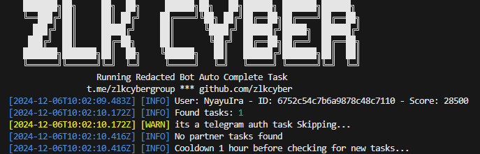

## Setup

1. Clone this repository:
   ```bash
   git clone https://github.com/Zlkcyber/readacted-bot.git
   cd readacted-bot
   ```
2. Install dependencies:
   ```bash
   npm install
   ```
3. put token in token.txt:
   ```bash
   nano token.txt
   ```
4. Run The Script:
   ```bash
   npm run start
   ```

## 

This project is licensed under the [MIT License](LICENSE).
